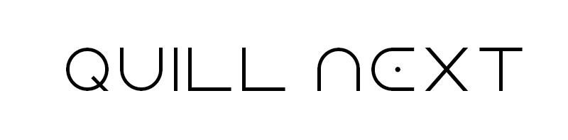

<h1 align="center">
  <a href="https://quilljs.com/" title="Quill">Quill Next</a>
</h1>
<p align="center">
  <a href="https://quilljs.com/" title="Quill"></a>
</p>
<p align="center">
  <a title="Documentation" href="https://quilljs.com/docs/quickstart"><strong>Documentation</strong></a>
  &#x2022;
  <a title="Development" href="https://github.com/slab/quill/blob/main/.github/DEVELOPMENT.md"><strong>Development</strong></a>
  &#x2022;
  <a title="Contributing" href="https://github.com/slab/quill/blob/main/.github/CONTRIBUTING.md"><strong>Contributing</strong></a>
  &#x2022;
  <a title="Interactive Playground" href="https://quilljs.com/playground/"><strong>Interactive Playground</strong></a>
</p>
<p align="center">
  <a href="https://github.com/slab/quill/actions" title="Build Status"></a>
  <a href="https://npmjs.com/package/quill-next" title="Version"></a>
</p>

<hr/>

**Quill Next** is a modern rich text editor built on the foundation of [Quill](https://quilljs.com/) by [Jason Chen](https://twitter.com/jhchen) and [Byron Milligan](https://twitter.com/byronmilligan). This fork is currently a personal project, aiming to keep Quill thriving and evolving.

Project Goals
-------------

1.  **Continued Maintenance**: We will actively maintain Quill Next, ensuring compatibility with modern web standards and regularly updating dependencies.

2.  **Better Integrations**: We aim to provide deeper integration with popular UI frameworks (especially React), allowing seamless embedding of React-based components within the editor.

3. **Bug Fixes**: We're dedicated to addressing known issues and community-reported bugs to make Quill Next as reliable and stable as possible.

4. **Compatibility**: Quill Next will remain fully compatible with the original Quill's API and Delta data structures.


## Quickstart

Instantiate a new Quill object with a css selector for the div that should become the editor.

```html
<!-- Include Quill stylesheet -->
<link
  href="https://cdn.jsdelivr.net/npm/quill@2/dist/quill.snow.css"
  rel="stylesheet"
/>

<!-- Create the toolbar container -->
<div id="toolbar">
  <button class="ql-bold">Bold</button>
  <button class="ql-italic">Italic</button>
</div>

<!-- Create the editor container -->
<div id="editor">
  <p>Hello World!</p>
  <p>Some initial <strong>bold</strong> text</p>
  <p><br /></p>
</div>

<!-- Include the Quill library -->
<script src="https://cdn.jsdelivr.net/npm/quill@2/dist/quill.js"></script>

<!-- Initialize Quill editor -->
<script>
  const quill = new Quill("#editor", {
    theme: "snow",
  });
</script>
```

Take a look at the [Quill](https://quilljs.com/) website for more documentation, guides and [live playground](https://quilljs.com/playground/)!

## Download

```shell
npm install quill-next
```

## License

BSD 3-clause
